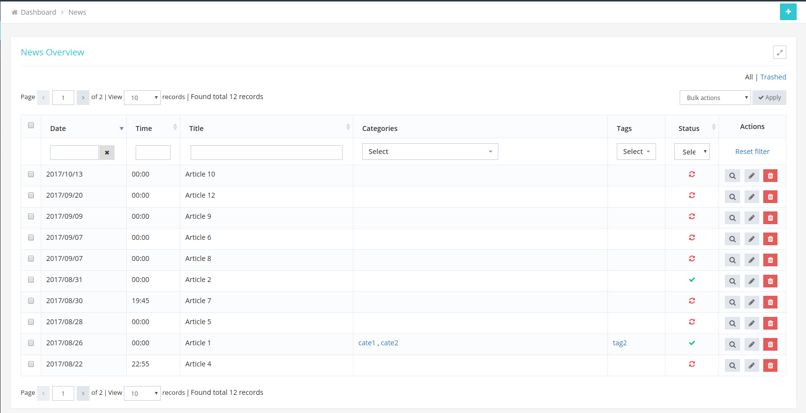

# Ajax datatable

This package allows you to use datatables as a plugin to perform CRUD actions in admin panel via AJAX calls.

# Table of Contents

- [Requirements](#requirements)
- [Installation](#installation)
- [Usage](#usage)
- [Configuration](#configuration)
    - [Table configuration](#table-configuration)
    - [Column configuration](#column-configuration)
    - [Bulk action configuration](#bulk-action-configuration)

# Requirements

* PHP >= 5.6
* Laravel >= 5.4

Beside that, this package also requires some packages

* jQuery >= 1.9
* jQuery blockUI : http://malsup.com/jquery/block/
* jQuery input mask : https://www.npmjs.com/package/inputmask
* Bootstrap >= 3 : https://www.npmjs.com/package/bootstrap
* Bootstrap date time picker
* Bootstrap select and select2
* MomentJS : https://www.npmjs.com/package/moment
* Toastr : https://www.npmjs.com/package/toastr
* Metronic theme : http://keenthemes.com/
* Font awesome : https://www.npmjs.com/package/font-awesome
* Datatables : https://www.npmjs.com/package/datatables

# Installation

Update the composer.json file:

```
{
    "require": {
        "elidev/ajax-datatable": "dev-master",
    },
    "repositories": [
        {
            "type": "vcs",
            "url": "http://git.elidev.info/khoaht/elidev-ajax-datatable.git"
        }
    ],
    "config": {
        "secure-http": false
    }
}
```

From the root directory of your project run the command:

```
composer update
```

In `config/app.php` file, load package service provider into your app

```
'providers' => [
    ...,

    Elidev\AjaxDatatable\AjaxDatatableServiceProvider::class,
    ...
]

```

Note: this is optional step. You can also publish package's config and view files into you app

```
$ php artisan vendor:publish --provider="Elidev\AjaxDatatable\AjaxDatatableServiceProvider"
```

In your `webpack.mix.js` file, you can paste this code to automatic copy ajax datatable resouce files to your `public` folder project.

```
/**
 * Ajax datatable
 */
mix.copyDirectory('vendor/elidev/ajax-datatable/public', 'public/vendor/ajax-datatable');
```

Then, run

```
$ npm run dev
```

Then, you can include Ajax datatable CSS & JS file as follow

```
// header.blade.php
<link href="/vendor/ajax-datatable/elidev.metronic.ajax.datatable.css" rel="stylesheet" type="text/css" id="style_color" />

// footer.blade.php
<script src="/vendor/ajax-datatable/elidev.metronic.ajax.datatable.js"></script>
```

# Usage

In your controller, you can define the table with columns and actions as follow

```
public function index(Request $request)
{
    $table = [
        'title' => 'News Overview',
        'id' => 'news-datatable',
        'ajax' => [
            'src' => 'news.more', // route name
        ],
        'columns' => [
            'title' => [
                'text' => 'Title',
                'orderable' => true,
            ],
            // ...
        ],
        'actions' => [
            'show'    => [
                'route' => 'news.show', // route name
                'role' => 'news.read',
            ],
            // ...
        ],

        // ...
    ];

    return view('news.list', [
        'table' => $table,
    ]);
}

// get data via ajax
public function more(Request $request)
{
    $news = News::paginate(15);
    $total = $news->total();

    return json_encode([
        'data'            => $news->getCollection()->toArray(),
        'recordsTotal'    => $total,
        'recordsFiltered' => $total,
    ]);
}
```

Then, in your view, just include the table

```
@include('ajaxdatatable::datatable')
```

Finally, init the datatables plugin in JS side

```
<script type="application/javascript">
$(document).ready(function() {
    AjaxDatatable.init();
});
</script>
```

Don't forget to define related routes.

# Configuration

## Table configuration

```
$table = [
    'title' => 'News Overview',

    // allow to filter items by their status (pending, publish)
    // this option will display [All | Trashed] bar in top of the table
    'filter_navigation' => true,

    // allow to display checkboxes in the table
    'checkbox_column' => true,

    // set default sort column for the table
    'order_default' => [
        'column' => 'available_date_only',
        'order' => 'desc', // or 'asc'
    ],
];
```

## Column configuration

- This is possible configuration for specific column

```
$table = [
    'title' => 'News Overview',
    'id' => 'news-datatable',
    'ajax' => [
        'src' => 'news.more', // route name
    ],
    'columns' => [
        'title' => [
            'text' => 'Title',
            'orderable' => true,      // allow sort on this column
            'width' => 10%,           // set the width of this column
            'class' => 'td-text-left' // set the column classes

            // you can also display pre-formatted html in a column
            // for example: display status check or un-check icon
            'html' => '<i class="fa fa-check font-green-jungle tooltips" data-placement="top" data-original-title="Publish"></i>',
            // or display an image
            // 'html' => 'avatar . '"/>',
        ],
        // ...
    ],
    // ...
];
```

- Allow filter on specific column. Currently, the system just allow filter for these types: input, select dropdown, date time pickers.

```
$table = [
    'title' => 'News Overview',
    'id' => 'news-datatable',
    'ajax' => [
        'src' => 'news.more', // route name
    ],
    'columns' => [
        'title' => [
            'text' => 'Title',

            // input filter
            'filter' => [
                'type' => 'input',
            ],
        ],

        'categories' => [
            'text' => 'Categories',

            // select dropdown filter
            'filter' => [
                'type' => 'select',
                'data' => $categories, // this data is queried from db or is fetched in another sources
            ],
        ],

        'available_date_only' => [
            'text'   => 'Date and time',

            // date time filter
            'filter' => [
                'type' => 'date',

                // you also can set the date time format here
                // for example: if current language is Germany, they will have the date time format like: d/m/Y H:i
                'format' => 'd/m/Y H:i',
            ],
        ],
        // ...
    ],
    // ...
];
```

- Action column configuration.  Currently, the system just supports these button types: show, edit, trash, restore, delete, unblock IP address, assign role.

```
$table = [
    'title' => 'News Overview',
    // ...

    'actions' => [
        'width'  => '100', // the width of the Action column
        'show'    => [
            'name'  => 'Add new',     // button text
            'route' => 'news.show',   // route name
            'role' => 'news.read',    // role, when use with the Elisoft ACL plugin: http://git.elidev.info/vulh/laravel-acl
            'icon' => 'fa fa-trash',  // button icon, use font awesome
            'color' => 'red-intense', // button color, use Metronic defined colors: http://keenthemes.com/preview/metronic/theme/admin_1/ui_colors.html
        ],
        // ...
    ],
];
```


## Bulk action configuration

You can config bulk actions (i.e: bulk trash, bulk restore, bulk delete) for specific table as follow

```
public function index(Request $request)
{
    $table = [
        'title' => 'News Overview',
        // ...

        'bulk_actions' => [
            [
                'name'   => 'bulk_trash',
                'text'   => 'Bulk trash items',
                'route'  => 'news.bulk_trash', // route name
                'method' => 'post',
                'is_displayed' => true
            ],
            [
                'name'   => 'bulk_restore',
                'text'   => 'Bulk restore items',
                'route'  => 'news.bulk_restore', // route name
                'method' => 'post',
                'is_displayed' => false
            ],
            [
                'name'   => 'bulk_delete',
                'text'   => 'Bulk delete items',
                'route'  => 'news.bulk_delete', // route name
                'method' => 'post',
                'is_displayed' => false
            ],
        ],
    ];

    return view('news.list', [
        'table' => $table,
    ]);
}
```

Then, in JS side, you can put your custom handle function for your bulk actions in the `onGroupActionSubmit` callback.

For example:

```
<script>
$(document).ready(function() {
    AjaxDatatable.init();

    AjaxDatatable.onGroupActionSubmit(function(action, grid) {
        var behaviour = action.val();

        switch (behaviour) {
            case 'bulk_trash':
            case 'bulk_restore':
            case 'bulk_delete':
                var selectedRows = grid.getSelectedRows(),
                    ajaxUrl      = action.find(':selected').data('ajax-url'),
                    ajaxMethod   = action.find(':selected').data('method');

                YourService.handle(selectedRows, ajaxUrl, ajaxMethod, behaviour);
            return;
        }

    });
});
</script>
```


